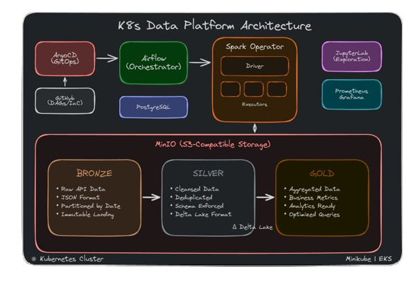

# K8s Data Platform | Spark + Delta Lake + Airflow on Kubernetes



## Overview

A production-ready data lakehouse platform running entirely on Kubernetes, demonstrating cloud-native data engineering patterns with infrastructure portability across local and cloud environments.

This project migrates a [brewery data pipeline](https://github.com/Gabriel-Philot/Case_Breweries_Abinbev) from standalone infrastructure to Kubernetes, showcasing how modern data platforms can achieve environment portability with minimal friction.

> **Credits**: Special thanks to [GersonRS](https://github.com/GersonRS) for the foundational [Spark-Airflow-K8s guide](https://github.com/GersonRS/hands-on-running-spark-jobs-with-airflow) that made this implementation possible.

## Key Features

| Feature | Description |
|---------|-------------|
| **Medallion Architecture** | Bronze → Silver → Gold data layers with Delta Lake |
| **GitOps Deployment** | ArgoCD manages all Kubernetes resources declaratively |
| **Event-Driven Pipelines** | Airflow Dataset triggers for pipeline orchestration |
| **Environment Portability** | Same codebase runs on Minikube and AWS EKS |
| **Spark on Kubernetes** | Native K8s scheduling via Spark Operator |
| **S3-Compatible Storage** | MinIO provides object storage abstraction |


## Technology Stack

| Layer | Technology | Version |
|-------|------------|---------|
| **Orchestration** | Apache Airflow | 2.x |
| **Processing** | Apache Spark | 3.3.2 |
| **Storage Format** | Delta Lake | 2.2.0 |
| **Object Storage** | MinIO | 12.2.0 |
| **Container Orchestration** | Kubernetes | 1.28+ |
| **GitOps** | ArgoCD | 5.27.1 |
| **Spark Management** | Spark Operator | 1.4.2 |
| **Secret Management** | Reflector | 7.0.151 |
| **Infrastructure** | Terraform | 1.3+ |
| **Monitoring** | Prometheus + Grafana | 15.0.0 / 7.3.3 |

## Project Structure

```
├── dags/                           # Airflow DAGs
│   ├── python_jobs/                # KubernetesPodOperator templates
│   │   ├── brewapi_ingestion.yaml
│   │   └── brewapi_validation.yaml
│   └── spark_jobs/                 # SparkApplication manifests
│       ├── bronze_to_silver.yaml
│       └── silver_to_gold.yaml
│
├── eks/                            # AWS EKS deployment
│   ├── access-control/             # RBAC configurations
│   ├── infra-terraform/            # Terraform modules for EKS
│   ├── manifests/                  # ArgoCD Application manifests
│   └── secrets/                    # Kubernetes secrets (Base64)
│
├── minikube/                       # Local Minikube deployment
│   ├── access-control/
│   ├── manifests/
│   └── secrets/
│
├── images/                         # Docker image sources
│   ├── python_ingestion/           # API ingestion container
│   ├── spark_brewery/              # Spark processing (Minikube)
│   ├── spark_eks_brewery/          # Spark processing (EKS)
│   └── custom_jupyterlab/          # JupyterLab with DuckDB
│
├── instructions/                   # Comprehensive documentation
│   ├── 01-prerequisites.md
│   ├── 02-architecture.md
│   ├── 03-minikube-deployment.md
│   ├── 04-eks-deployment.md
│   ├── 05-operating-the-platform.md
│   └── 06-troubleshooting.md
│
└── download-jars.bash              # Spark dependency downloader
```

## Quick Start

### Prerequisites

- Docker 20.10+
- kubectl 1.28+
- Helm 3.12+
- SSH key configured for GitHub

### Local Development (Minikube)

```bash
# Start Minikube
minikube start --memory=8000 --cpus=2

# In a separate terminal, enable LoadBalancer
minikube tunnel

# Create namespaces
kubectl create namespace orchestrator database processing deepstorage cicd management misc monitoring jupyter

# Install ArgoCD
helm repo add argo https://argoproj.github.io/argo-helm
helm install argocd argo/argo-cd --namespace cicd --version 5.27.1
```

See [Minikube Deployment Guide](instructions/03-minikube-deployment.md) for complete setup.

### Production (AWS EKS)

```bash
# Provision infrastructure
cd eks/infra-terraform
terraform init && terraform apply

# Connect kubectl
aws eks --region us-east-2 update-kubeconfig --name k8s-aws
```

See [EKS Deployment Guide](instructions/04-eks-deployment.md) for complete setup.

## Data Pipeline

### Ingestion & Validation DAG

Fetches brewery data from public API, stores in Bronze layer, and validates record counts:

```
Start → Fetch API → Store Bronze → Validate Counts → Trigger Processing (Dataset)
```

### Processing DAG

Transforms data through medallion layers:

```
Dataset Trigger → Bronze → Silver (Cleanse/Dedupe) → Gold (Aggregate)
```

### Running Pipelines

Via Airflow UI:
1. Access `http://<AIRFLOW_IP>:8080`
2. Enable `brewapi-ingestion-validation-minio`
3. Processing DAG triggers automatically via Dataset

## Environment Portability

The same DAGs and Spark jobs run on both environments with minimal changes:

| Component | Minikube | EKS |
|-----------|----------|-----|
| Storage Class | `standard` | `gp2` |
| Image Registry | Local (`eval $(minikube docker-env)`) | DockerHub |
| Load Balancer | `minikube tunnel` | AWS ELB |
| Spark Image | `spark_brewery` | `spark_eks_brewery` |

Key files that differ:
- `manifests/deepstorage/minio.yaml`
- `manifests/database/postgres.yaml`

## Accessing Services

| Service | URL | Credentials |
|---------|-----|-------------|
| Airflow | `http://<LB_IP>:8080` | admin / admin |
| ArgoCD | `http://<LB_IP>` | admin / (auto-generated) |
| MinIO | `http://<LB_IP>:9000` | miniouser / miniosecret |
| JupyterLab | `http://<LB_IP>:8888` | Token-based |

## Development Status

### Completed
- [x] Core pipeline (Ingestion → Validation → Processing)
- [x] Minikube deployment
- [x] EKS deployment with Terraform
- [x] JupyterLab integration with DuckDB
- [x] GitOps with ArgoCD
- [x] Secret management with Reflector

### In Progress
- [ ] Prometheus metrics integration
- [ ] Grafana dashboards for Spark/Airflow
- [ ] Airflow best practices refinement

### Planned
- [ ] GKE deployment
- [ ] CI/CD pipeline
- [ ] Data catalog integration

## Documentation

| Document | Description |
|----------|-------------|
| [Prerequisites](instructions/01-prerequisites.md) | Required tools and accounts |
| [Architecture](instructions/02-architecture.md) | System design and data flow |
| [Minikube Setup](instructions/03-minikube-deployment.md) | Local deployment guide |
| [EKS Setup](instructions/04-eks-deployment.md) | AWS production deployment |
| [Operations](instructions/05-operating-the-platform.md) | Running and monitoring pipelines |
| [Troubleshooting](instructions/06-troubleshooting.md) | Common issues and solutions |

## License

This project is licensed under the Apache License 2.0 - see the [LICENSE](LICENSE) file for details.

## Acknowledgments

- [GersonRS](https://github.com/GersonRS) for the foundational Spark-on-K8s guide
- [Open Brewery DB](https://www.openbrewerydb.org/) for the public API
- Kubernetes, Apache Spark, and Apache Airflow communities
